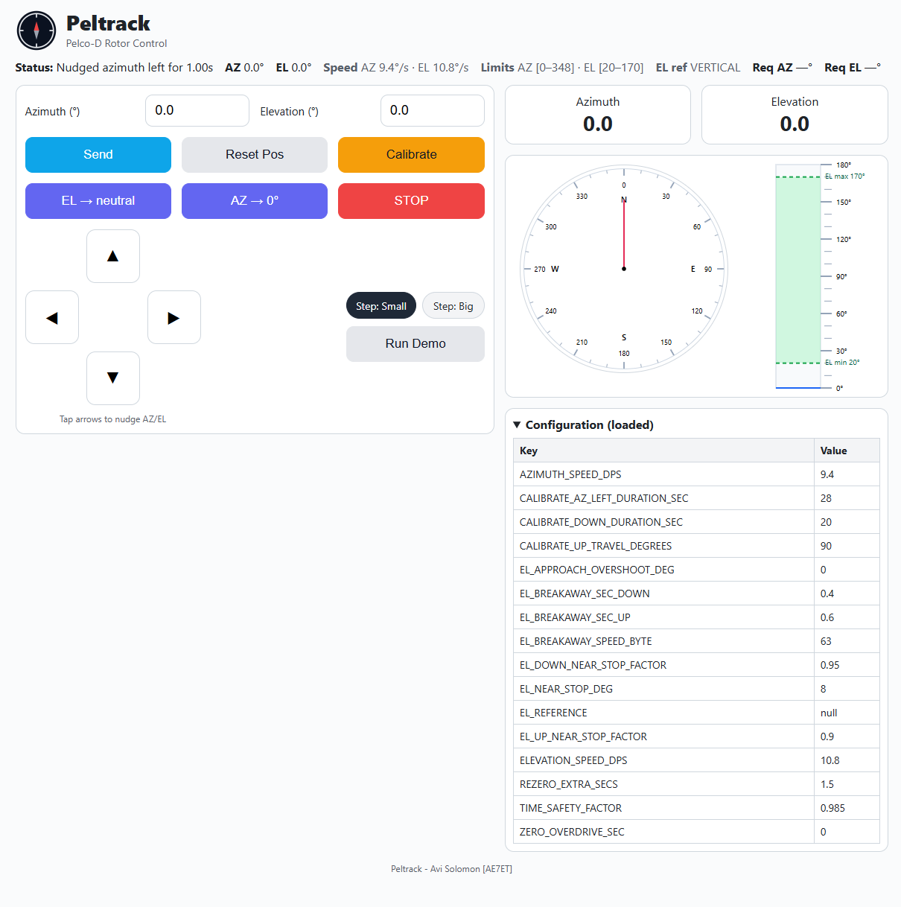

# Peltrack

## Pelco-D Rotor Controller for Amateur (Ham) Radio Operators

Peltrack is a Python controller for Pelco-D pan/tilt rotors. It includes:

- A responsive web UI with live gauges and color-coded controls  
- A calibration modal with progress bar, stage text, and live log  
- A TCP server that speaks EasyComm II / Hamlib rotctld-style commands (for Gpredict)  
- Robust backend motion control with locking and cancel-aware timing  
- Optional elevation stiction handling (breakaway pulses) near mechanical stops  
- Configurable mechanical limits and tunable motion parameters  

> Note: Most Pelco-D heads don’t report their absolute position. Peltrack uses time-based (open-loop) control with calibrated speeds, safety factors, and optional “breakaway” pulses to be reliable in practice.



---

## 🔧 Requirements

- Python 3.10+  
- Pelco-D compatible rotor (RS-485)  
- USB–RS485 adapter (e.g., CH340, FTDI)  

---

### Install

```bash
python -m venv venv

# Windows
venv\Scripts\activate
# macOS/Linux
source venv/bin/activate

pip install -r requirements.txt
```

---

## 🚀 Usage

### 1) Initial speed calibration (°/s)

Accurate control requires the rotor’s real speeds.

```bash
python calibrate.py
```

You’ll be prompted to run short timed motions and enter the measured degrees. The script writes:

```json
config.json
{
  "AZIMUTH_SPEED_DPS": 6.0,
  "ELEVATION_SPEED_DPS": 3.0
}
```

> Use the datasheet values as a starting point (often pan ~6°/s, tilt ~3°/s), then refine with the tool.

### 2) Start the server + web UI

```bash
python peltrack.py --port COM4 --baud 2400
# or: python peltrack.py --port /dev/ttyUSB0 --baud 2400
```

- Web UI: http://localhost:5000  
- Gpredict / TCP: port 4533  

### 3) Gpredict setup

1. Preferences → Interfaces → Rotator  
2. Add a rotator:  
   - Hostname: `localhost`  
   - Port: `4533`  
   - Protocol: `Hamlib rotctld` *or* `EasyComm II`  
3. Activate the interface during tracking.  

---

## ⚙️ Configuration

### `config.json` (saved by calibration / tunable at runtime)

Core:
```json
{
  "AZIMUTH_SPEED_DPS": 6.0,
  "ELEVATION_SPEED_DPS": 3.0,
  "TIME_SAFETY_FACTOR": 0.985
}
```

Calibration modal timing (for the backend calibration procedure):
```json
{
  "CALIBRATE_DOWN_DURATION_SEC": 10,
  "CALIBRATE_UP_TRAVEL_DEGREES": 90,
  "CALIBRATE_AZ_LEFT_DURATION_SEC": 40
}
```

Stiction & approach options (optional — useful when EL starts at a stop under load):
```json
{
  "EL_NEAR_STOP_DEG": 8.0,
  "EL_BREAKAWAY_SEC_UP": 0.6,
  "EL_BREAKAWAY_SEC_DOWN": 0.4,
  "EL_BREAKAWAY_SPEED_BYTE": 63,
  "EL_UP_NEAR_STOP_FACTOR": 0.90,
  "EL_DOWN_NEAR_STOP_FACTOR": 0.95,
  "EL_APPROACH_OVERSHOOT_DEG": 0.0,
  "ZERO_OVERDRIVE_SEC": 0.0
}
```
**EL_NEAR_STOP_DEG** — Angular range near a mechanical stop (e.g., ±8°). Inside this zone, the rotor may behave differently due to load or stiction.

Example: 8.0 → Consider the last 8° near the top/bottom as “special handling.”


**EL_BREAKAWAY_SEC_UP** — Extra pulse time when moving upward from a stop to overcome stiction.

Example: 0.6 → Add a 0.6 s upward pulse at start, not counted toward timing.

**EL_BREAKAWAY_SEC_DOWN** — Same as above but for downward moves.

Example: 0.4 → Add a 0.4 s downward pulse when leaving a top stop.

**EL_BREAKAWAY_SPEED_BYTE** — Speed byte (0–63) used during breakaway pulses.

Example: 63 → Use maximum speed during the pulse.

**EL_UP_NEAR_STOP_FACTOR** — Scale factor for elevation speed when moving upward near a stop. Helps avoid overshoot.

Example: 0.90 → Use 90% of calibrated speed when within EL_NEAR_STOP_DEG.

**EL_DOWN_NEAR_STOP_FACTOR** — Same, but for downward moves.

Example: 0.95 → Use 95% of calibrated speed near a stop.

**EL_APPROACH_OVERSHOOT_DEG** — Extra degrees to overshoot when approaching EL=90° (zenith), then settle back. Useful for heavy loads that sag.

Example: 2.0 → Go 2° past 90, then return to 90.

**ZERO_OVERDRIVE_SEC** — Extra leftward pulse time when returning to AZ=0. Helps “seat” the rotor against its mechanical zero.

Example: 1.0 → Add a 1 second left pulse at azimuth zero.

### `limits.json` 

Define mechanical limits used by the UI and backend clamping:

```json
{
  "az_min": 0,
  "az_max": 350,
  "el_min": 30,
  "el_max": 150
}
```

> The web UI shows your request and whether it was clamped. Backend timing always uses clamped values.

---

## 🧠 How motion is kept sane

- Serialized: only one move runs at a time (global lock)  
- Axis-staggered: both axes start; the shorter finishes first; the longer continues alone  
- Cancel-aware: sleeps are chunked; STOP will halt between ticks and we record partial progress  
- Open-loop: since most Pelco-D heads don’t report angle, we depend on calibrated °/s + safety factor  
- Breakaway (optional): a short high-speed tilt pulse when leaving a stop, not counted in the target’s timing  
- Re-zero (optional): an extra brief left pulse at AZ=0° requests to “seat” mechanical zero  

---

## 🧪 Tested with

- Windows 11 + Python 3.11  
- CH340/FTDI USB–RS485  
- Gpredict 2.3  
- Typical Pelco-D outdoor pan/tilt heads (datasheet: Pan ~350°, Tilt ±60°, Pan ~6°/s, Tilt ~3°/s)  

---

## 📁 Project structure

```
peltrack/
├── calibrate.py           # CLI to measure AZ/EL speeds (°/s)
├── config.json            # Saved calibration/tuning
├── easycomm_server.py     # EasyComm/Hamlib TCP bridge (for Gpredict)
├── page_template.py       # Web UI (single page, live gauges, modal)
├── pelco_commands.py      # Motion logic (locking, cancel-aware, stiction, etc.)
├── peltrack.py            # Flask + Socket.IO app and server bootstrap
├── limits.json            # Mechanical range limits
├── requirements.txt       # Python dependencies
└── state.py               # Thread-safe state/config/serial handle
```

---

## 📜 License

MIT — Provided “as is.” Use at your own risk.

---

## 👋 Credits

Avi Solomon (AE7ET) - 2025
